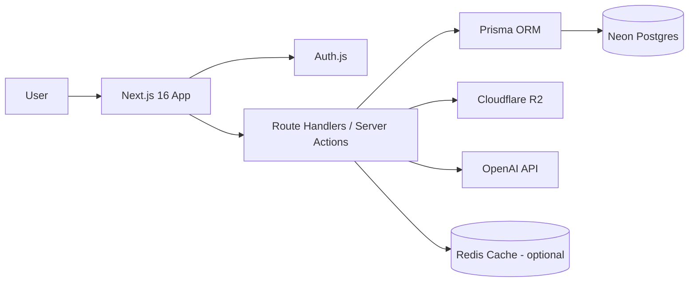
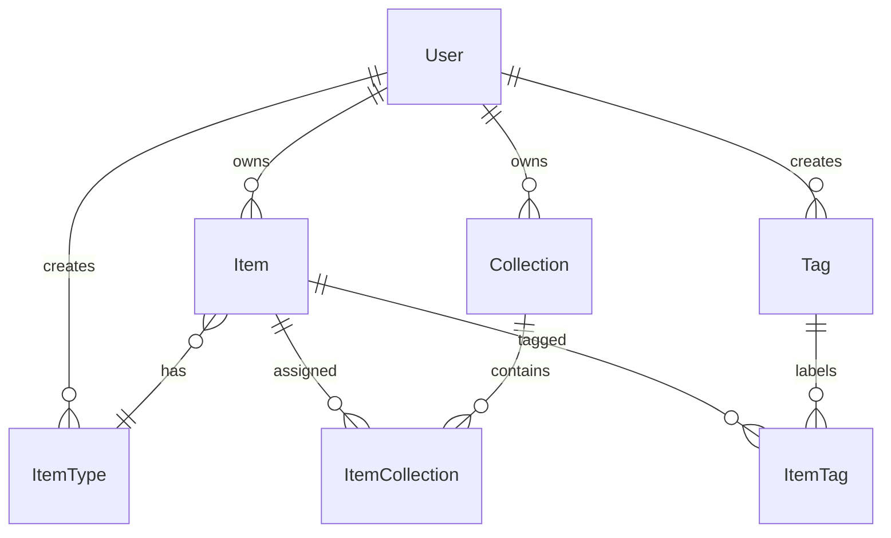

# DevStash Project Overview

> DevStash is a developer-first SaaS for storing, organizing, and retrieving the small but critical pieces of working knowledge that usually get scattered across editors, chats, folders, bookmarks, and shell history.

## 1. Product Summary

### Problem
Developers constantly lose time to context switching:

- code snippets in VS Code or Notion
- prompts buried in AI chats
- commands lost in shell history
- links spread across bookmarks
- docs stored in random folders
- reusable templates hidden in gists or old repos

DevStash solves this by giving users **one fast, searchable, AI-enhanced hub** for developer knowledge.

### Core Value Proposition
- **Capture quickly**: create items from a drawer with minimal friction.
- **Find instantly**: search by title, content, tag, or type.
- **Organize flexibly**: reuse items across multiple collections.
- **Upgrade with AI**: tag, summarize, explain, and optimize developer content.

## 2. Target Users

- **Everyday Developer**: saves snippets, commands, notes, and links for daily work.
- **AI-First Developer**: stores prompts, system messages, workflows, and context files.
- **Content Creator / Educator**: keeps examples, course notes, code samples, and explanations.
- **Full-Stack Builder**: collects patterns, boilerplates, API references, and implementation recipes.

## 3. Product Scope

### System Item Types
These ship first and are not user-editable:

| Type | Storage Mode | Icon | Color |
| --- | --- | --- | --- |
| `snippet` | text | `Code` | `#3b82f6` |
| `prompt` | text | `Sparkles` | `#8b5cf6` |
| `note` | text | `StickyNote` | `#fde047` |
| `command` | text | `Terminal` | `#f97316` |
| `link` | url | `Link` | `#10b981` |
| `file` | file | `File` | `#6b7280` |
| `image` | file | `Image` | `#ec4899` |

Suggested routes:

- `/items/snippets`
- `/items/prompts`
- `/items/commands`
- `/collections/[slug]`

### Core Features
- Fast item creation and editing in a drawer
- Collections with many-to-many item membership
- Favorites and pinning
- Recent activity
- Markdown editor for text-based items
- File import and upload support
- Multi-collection assignment
- Export support
- Search across title, content, tags, and type
- Auth via email/password and GitHub

### Pro Features
- File and image uploads
- AI auto-tagging
- AI summaries
- AI code explanation
- Prompt optimizer
- Export as JSON/ZIP

> During development, all users can access Pro capabilities. Billing and limits should be implemented as feature gates, not hard-coded assumptions.

## 4. Monetization

### Free
- 50 items
- 3 collections
- Basic search
- Text and link-based system types only
- No uploads
- No AI features

### Pro
- Unlimited items
- Unlimited collections
- File and image uploads
- AI features
- Export tools
- Priority support

Pricing target:
- **$8/month**
- **$72/year**

## 5. UX Direction

DevStash should feel like a blend of **Notion**, **Linear**, and **Raycast**:

- dark mode first
- minimal but premium
- generous spacing
- subtle borders and shadows
- syntax highlighting for code
- responsive sidebar that becomes a drawer on mobile
- quick item drawer everywhere
- toast feedback, hover states, and loading skeletons

## 6. Architecture Overview



### Technical Decisions
- **Frontend**: Next.js 16 + React 19 + TypeScript
- **UI**: Tailwind CSS v4 + shadcn/ui
- **Database**: Neon PostgreSQL
- **ORM**: Prisma ORM
- **Auth**: Auth.js with GitHub OAuth and credentials
- **Storage**: Cloudflare R2 for uploaded files/images
- **AI**: OpenAI `gpt-5-nano`
- **Caching**: Redis optional for search, AI job state, and rate limiting

### Important Constraint
- Use **Prisma Migrate**
- **Never use `prisma db push` in this project**
- Schema changes should always go through reviewed migrations in dev, then prod

## 7. Prisma Data Model Draft

```prisma
enum PlanTier {
  FREE
  PRO
}

enum ItemContentType {
  TEXT
  URL
  FILE
}

model User {
  id                     String       @id @default(cuid())
  name                   String?
  email                  String?      @unique
  passwordHash           String?
  image                  String?
  planTier               PlanTier     @default(FREE)
  isPro                  Boolean      @default(false)
  stripeCustomerId       String?      @unique
  stripeSubscriptionId   String?      @unique
  createdAt              DateTime     @default(now())
  updatedAt              DateTime     @updatedAt
  items                  Item[]
  collections            Collection[]
  itemTypes              ItemType[]
}

model Item {
  id              String            @id @default(cuid())
  userId          String
  itemTypeId      String
  title           String
  description     String?
  contentType     ItemContentType
  content         String?
  url             String?
  fileUrl         String?
  fileName        String?
  fileSize        Int?
  language        String?
  isFavorite      Boolean           @default(false)
  isPinned        Boolean           @default(false)
  createdAt       DateTime          @default(now())
  updatedAt       DateTime          @updatedAt
  user            User              @relation(fields: [userId], references: [id], onDelete: Cascade)
  itemType        ItemType          @relation(fields: [itemTypeId], references: [id])
  tags            ItemTag[]
  collections     ItemCollection[]
}

model ItemType {
  id              String        @id @default(cuid())
  userId          String?
  name            String
  slug            String
  icon            String
  color           String
  isSystem        Boolean       @default(false)
  createdAt       DateTime      @default(now())
  updatedAt       DateTime      @updatedAt
  user            User?         @relation(fields: [userId], references: [id], onDelete: Cascade)
  items           Item[]

  @@unique([userId, slug])
}

model Collection {
  id              String            @id @default(cuid())
  userId          String
  name            String
  slug            String
  description     String?
  isFavorite      Boolean           @default(false)
  defaultTypeId   String?
  createdAt       DateTime          @default(now())
  updatedAt       DateTime          @updatedAt
  user            User              @relation(fields: [userId], references: [id], onDelete: Cascade)
  items           ItemCollection[]

  @@unique([userId, slug])
}

model ItemCollection {
  itemId          String
  collectionId    String
  addedAt         DateTime @default(now())
  item            Item       @relation(fields: [itemId], references: [id], onDelete: Cascade)
  collection      Collection @relation(fields: [collectionId], references: [id], onDelete: Cascade)

  @@id([itemId, collectionId])
}

model Tag {
  id              String    @id @default(cuid())
  userId          String
  name            String
  slug            String
  createdAt       DateTime  @default(now())
  user            User      @relation(fields: [userId], references: [id], onDelete: Cascade)
  items           ItemTag[]

  @@unique([userId, slug])
}

model ItemTag {
  itemId          String
  tagId           String
  item            Item @relation(fields: [itemId], references: [id], onDelete: Cascade)
  tag             Tag  @relation(fields: [tagId], references: [id], onDelete: Cascade)

  @@id([itemId, tagId])
}
```

### Entity Relationships



## 8. Search Model

Search should support:

- title
- content
- tags
- type
- language

Recommended path:
1. Start with PostgreSQL full-text search and indexed filters.
2. Add ranking, recent weighting, and pinned boosts.
3. Add Redis caching only if query volume justifies it.

## 9. AI Capabilities

AI should be **assistive**, not blocking:

- suggest tags on save
- summarize long notes or docs
- explain stored code snippets
- optimize prompts for clarity and structure

Guardrails:
- only run AI on eligible Pro features
- store generated outputs separately from original content
- log token usage for future billing controls

## 10. Delivery Phases

### Phase 1
- auth
- item CRUD
- collections
- tags
- search
- item drawer UX

### Phase 2
- file and image upload
- favorites, pinning, recents
- markdown editor
- export

### Phase 3
- AI features
- usage limits
- Stripe billing
- custom item types

## 11. Reference Links

- [Next.js Docs](https://nextjs.org/docs)
- [Prisma ORM Docs](https://docs.prisma.io/docs/orm)
- [Prisma ORM v7 Upgrade Guide](https://docs.prisma.io/docs/guides/upgrade-prisma-orm/v7)
- [Auth.js Docs](https://authjs.dev/)
- [Tailwind CSS v4](https://tailwindcss.com/blog/tailwindcss-v4)
- [shadcn/ui Docs](https://ui.shadcn.com/docs)
- [Neon Docs](https://neon.tech/docs)
- [Cloudflare R2 Docs](https://developers.cloudflare.com/r2/)

## 12. Product North Star

DevStash should become the default place a developer saves anything they want to reuse later:

**snippet, prompt, command, note, link, file, or image.**
